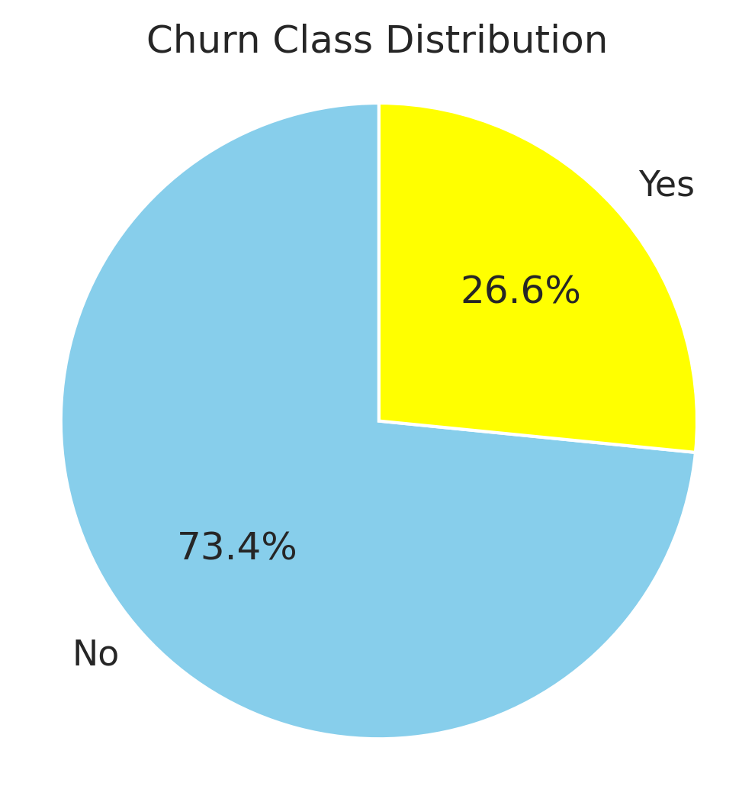
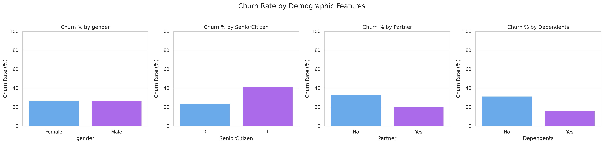
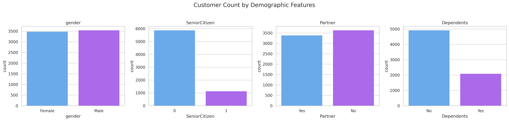
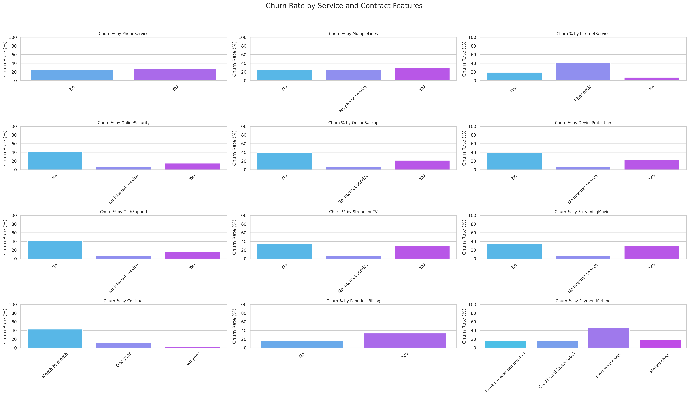
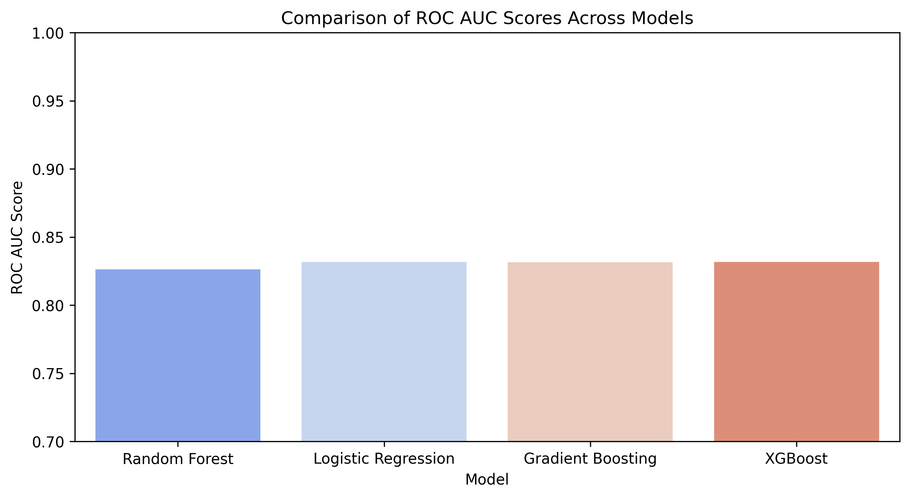
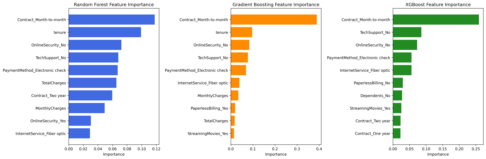

# Telco Customer Churn Prediction

A complete machine learning pipeline to predict customer churn for a telecom provider. The goal is to identify high-risk customers early and take action to reduce churn, boost retention, and increase customer lifetime value.

---

## Business Context

Churn is a critical issue in telecom—acquiring new customers is significantly more expensive than retaining existing ones. This project leverages customer demographics, contract types, and service usage patterns to build predictive models and uncover key churn drivers.

**Dataset:**  
[Kaggle - Telco Customer Churn](https://www.kaggle.com/datasets/blastchar/telco-customer-churn)

---

## Data Exploration & Key Insights

### Churn Distribution
The dataset is **imbalanced**, with ~73% of customers not churning. 



### Demographic Features

- **Senior citizens** churn significantly more (~40%) than non-seniors (~23%), but are a smaller target group.
- **Customers without partners or dependents** are more likely to churn.
- **Gender** has minimal effect on churn likelihood.





### Service & Contract Features

- **Fiber optic users** churn nearly 2× more than DSL users.
- **No tech support / online security** correlates strongly with churn.
- **Month-to-month contract** users have the highest churn (~40%).



---

## Preprocessing

- **Encoding:** One-hot encoding used for categorical variables (non-ordinal).
- **Imbalance Handling:** SMOTE applied to balance churn classes.
- **Scaling:** Applied for ML algorithms.

---

## Model Performance

| Model                | ROC AUC | Accuracy | Precision | Recall | F1 Score |
|---------------------|---------|----------|-----------|--------|----------|
| Logistic Regression | 0.8316  | 0.7356   | 0.5017    | **0.7914** | 0.6141   |
| Random Forest        | 0.8263  | 0.7640   | 0.5438    | 0.6979 | 0.6112   |
| Gradient Boosting    | 0.8316  | **0.7719** | **0.5604** | 0.6578 | 0.6052   |
| XGBoost              | **0.8318** | 0.7676   | 0.5512    | 0.6765 | **0.6074**   |

### Highlights

- 📈 **Best ROC AUC**: XGBoost
- 🧠 **Most Balanced**: XGBoost (good precision & recall)
- 🎯 **Max Recall**: Logistic Regression (ideal if catching all churners is priority)
- 💡 **Max Precision**: Gradient Boosting (useful when false positives are costly)



---

## Feature Importance

- **Month-to-month contracts**, **short tenure**, and **lack of support services** are top churn indicators.
- **Electronic check payments** also flag higher churn risk.



---

## 📁 Project Structure
```
├── data/ # Raw and processed datasets
├── models/ # Saved model artifacts
├── notebooks/ # EDA and modeling
│ ├── 01_eda_and_cleaning.ipynb
│ └── 02_customer_churn_prediction_model.ipynb
├── src/ # Source scripts
│ ├── config.py
│ ├── data_loader.py
│ ├── evaluate.py
│ ├── pipeline.py
│ ├── preprocess.py
│ └── train.py
├── visuals/ # EDA and model output plots
├── main.py # Main entry point
├── requirements.txt # Dependencies
└── README.md # Project documentation
```
---

## How to Run the Project

### Option 1: Run Full Pipeline

```bash
python main.py
```

### Option 2: Explore in Jupyter Notebooks
```bash
jupyter notebook notebooks/01_eda_and_cleaning.ipynb
jupyter notebook notebooks/02_customer_churn_prediction_model.ipynb
```

Install dependencies with:
```bash
pip install -r requirements.txt
```

## Next Steps
- Add SHAP or LIME for explainability.
- Deploy best model as a REST API.
- Build an interactive churn dashboard.

